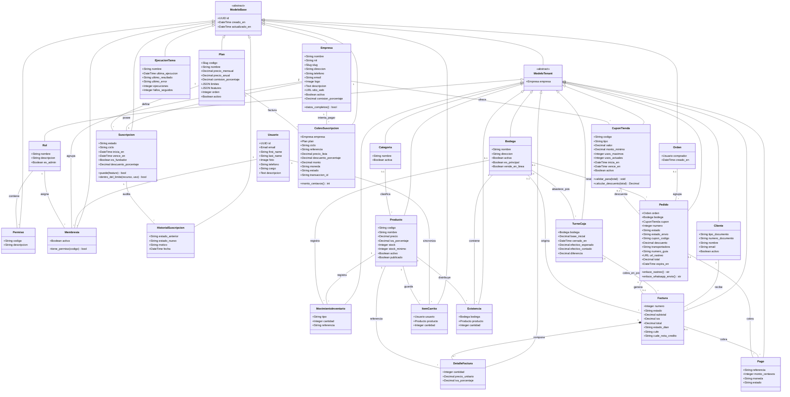

# Diagrama de Clases UML — InterSoft

Representación orientada a objetos de los modelos principales del proyecto (`core` y `suscripciones`).

```mermaid
classDiagram
    direction TB

    class ModeloBase {
        <<abstract>>
        +UUID id
        +DateTime creado_en
        +DateTime actualizado_en
    }

    class ModeloTenant {
        <<abstract>>
        +Empresa empresa
    }

    class Usuario {
        +UUID id
        +Email email
        +String first_name
        +String last_name
        +Image foto
        +String telefono
        +String cargo
        +Text descripcion
    }

    class Empresa {
        +String nombre
        +String nit
        +Slug slug
        +String direccion
        +String telefono
        +String email
        +Image logo
        +Text descripcion
        +URL sitio_web
        +Boolean activa
        +Decimal comision_porcentaje
        +datos_completos() bool
    }

    class Permiso {
        +String codigo
        +String descripcion
    }

    class Rol {
        +String nombre
        +String descripcion
        +Boolean es_admin
    }

    class Membresia {
        +Boolean activa
        +tiene_permiso(codigo) bool
    }

    class Plan {
        +Slug codigo
        +String nombre
        +Decimal precio_mensual
        +Decimal precio_anual
        +Decimal comision_porcentaje
        +JSON limites
        +JSON features
        +Integer orden
        +Boolean activo
    }

    class Suscripcion {
        +String estado
        +String ciclo
        +DateTime inicia_en
        +DateTime vence_en
        +Boolean es_fundador
        +Decimal descuento_porcentaje
        +puede(feature) bool
        +dentro_del_limite(recurso, uso) bool
    }

    class HistorialSuscripcion {
        +String estado_anterior
        +String estado_nuevo
        +String motivo
        +DateTime fecha
    }

    class Categoria {
        +String nombre
        +Boolean activa
    }

    class Producto {
        +String codigo
        +String nombre
        +Decimal precio
        +Decimal iva_porcentaje
        +Integer stock
        +Integer stock_minimo
        +Boolean activo
        +Boolean publicado
    }

    class MovimientoInventario {
        +String tipo
        +Integer cantidad
        +String referencia
    }

    class Cliente {
        +String tipo_documento
        +String numero_documento
        +String nombre
        +String email
        +Boolean activo
    }

    class Factura {
        +Integer numero
        +String estado
        +Decimal subtotal
        +Decimal iva
        +Decimal total
        +String estado_dian
        +String cufe
        +String cude_nota_credito
    }

    class DetalleFactura {
        +Integer cantidad
        +Decimal precio_unitario
        +Decimal iva_porcentaje
    }

    class TurnoCaja {
        +Bodega bodega
        +Decimal base_inicial
        +DateTime cerrado_en
        +Decimal efectivo_esperado
        +Decimal efectivo_contado
        +Decimal diferencia
    }

    class Orden {
        +Usuario comprador
        +DateTime creado_en
    }

    class CuponTienda {
        +String codigo
        +String tipo
        +Decimal valor
        +Decimal monto_minimo
        +Integer usos_maximos
        +Integer usos_actuales
        +DateTime inicia_en
        +DateTime vence_en
        +Boolean activo
        +validar_para(total) void
        +calcular_descuento(total) Decimal
    }

    class ItemCarrito {
        +Usuario usuario
        +Producto producto
        +Integer cantidad
    }

    class Pedido {
        +Orden orden
        +Bodega bodega
        +CuponTienda cupon
        +Integer numero
        +String estado
        +String estado_envio
        +String cupon_codigo
        +Decimal descuento
        +String transportadora
        +String numero_guia
        +URL url_rastreo
        +Decimal total
        +DateTime expira_en
        +enlace_rastreo() str
        +enlace_whatsapp_envio() str
    }

    class Bodega {
        +String nombre
        +String direccion
        +Boolean activa
        +Boolean es_principal
        +Boolean vende_en_linea
    }

    class Existencia {
        +Bodega bodega
        +Producto producto
        +Integer cantidad
    }

    class EjecucionTarea {
        +String nombre
        +DateTime ultima_ejecucion
        +String ultimo_resultado
        +String ultimo_error
        +Integer ejecuciones
        +Integer fallos_seguidos
    }

    class CobroSuscripcion {
        +Empresa empresa
        +Plan plan
        +String ciclo
        +String referencia
        +Decimal precio_lista
        +Decimal descuento_porcentaje
        +Decimal monto
        +String moneda
        +String estado
        +String transaccion_id
        +monto_centavos() int
    }

    class Pago {
        +String referencia
        +Integer monto_centavos
        +String moneda
        +String estado
    }

    ModeloBase <|-- ModeloTenant
    ModeloBase <|-- Empresa
    ModeloBase <|-- Permiso
    ModeloBase <|-- Membresia
    ModeloBase <|-- Plan
    ModeloBase <|-- Suscripcion
    ModeloBase <|-- HistorialSuscripcion
    ModeloBase <|-- Orden
    ModeloBase <|-- ItemCarrito
    ModeloBase <|-- EjecucionTarea
    ModeloBase <|-- CobroSuscripcion

    ModeloTenant <|-- Rol
    ModeloTenant <|-- Bodega
    ModeloTenant <|-- Existencia
    ModeloTenant <|-- Categoria
    ModeloTenant <|-- Producto
    ModeloTenant <|-- MovimientoInventario
    ModeloTenant <|-- Cliente
    ModeloTenant <|-- Factura
    ModeloTenant <|-- DetalleFactura
    ModeloTenant <|-- TurnoCaja
    ModeloTenant <|-- CuponTienda
    ModeloTenant <|-- Pedido
    ModeloTenant <|-- Pago

    Usuario "1" -- "*" Membresia : participa
    Empresa "1" -- "*" Membresia : agrupa
    Rol "1" -- "*" Membresia : asigna
    Rol "*" -- "*" Permiso : contiene

    Empresa "1" -- "1" Suscripcion : posee
    Plan "1" -- "*" Suscripcion : define
    Suscripcion "1" -- "*" HistorialSuscripcion : audita

    Categoria "0..1" -- "*" Producto : clasifica
    Producto "1" -- "*" MovimientoInventario : registra
    Cliente "1" -- "*" Factura : recibe
    Factura "1" *-- "1..*" DetalleFactura : compone
    Producto "1" -- "*" DetalleFactura : referencia
    TurnoCaja "0..1" -- "*" Factura : cobra_en_pos
    Pedido "1" -- "0..1" Factura : genera
    Orden "0..1" -- "*" Pedido : agrupa
    Bodega "1" -- "*" Existencia : contiene
    Producto "1" -- "*" Existencia : distribuye
    Bodega "0..1" -- "*" MovimientoInventario : registra
    Bodega "0..1" -- "*" TurnoCaja : abastece_pos
    Bodega "0..1" -- "*" Factura : origina
    Bodega "0..1" -- "*" Pedido : reserva
    Empresa "1" -- "*" CobroSuscripcion : intenta_pagar
    Plan "1" -- "*" CobroSuscripcion : factura
    Factura "0..1" -- "*" Pago : cobra
    Pedido "0..1" -- "*" Pago : cobra
    Empresa "1" -- "*" CuponTienda : ofrece
    CuponTienda "0..1" -- "*" Pedido : descuenta
    Usuario "1" -- "*" ItemCarrito : sincroniza
    Producto "1" -- "*" ItemCarrito : guarda
```
